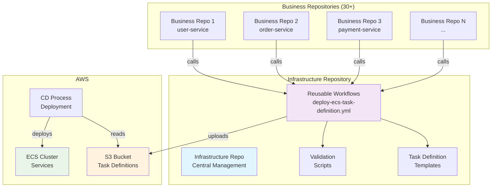
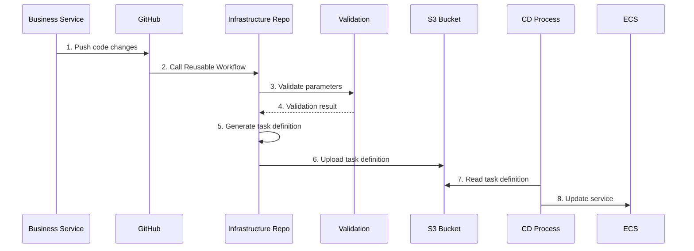
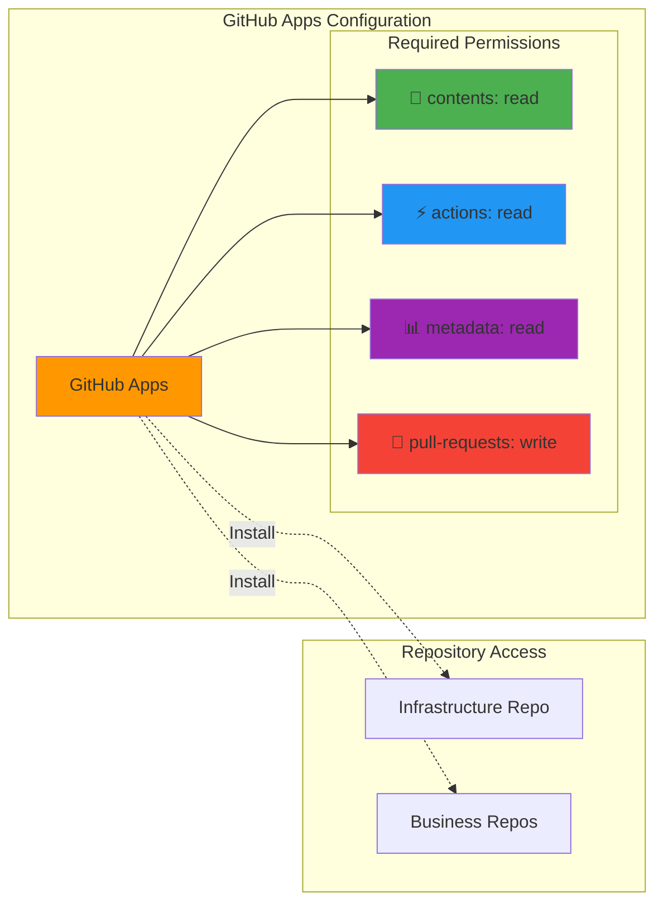
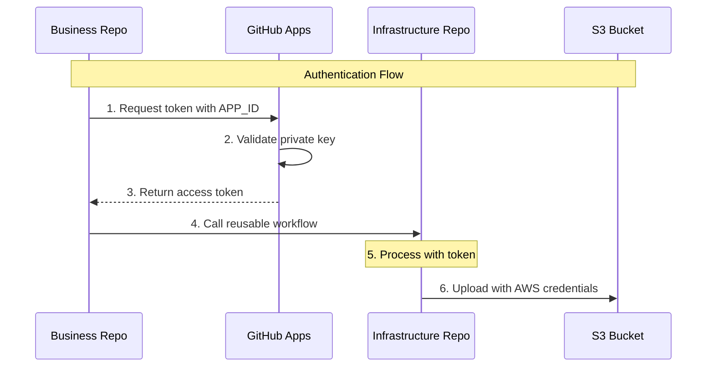
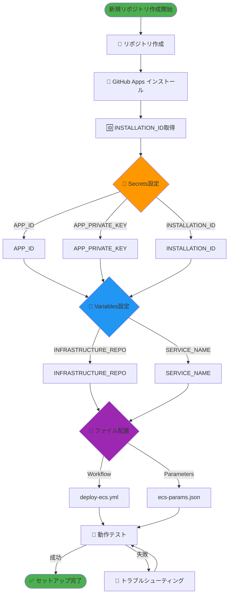
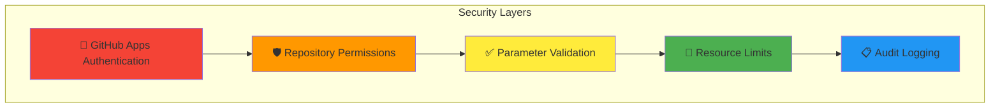

# ECS タスク定義ファイル管理構成設計書

## 目次
1. [概要](#概要)
2. [要件](#要件)
3. [アーキテクチャ](#アーキテクチャ)
4. [ファイル構成](#ファイル構成)
5. [認証設定](#認証設定)
6. [セットアップ手順](#セットアップ手順)
7. [具体的な実装例](#具体的な実装例)

## 概要

本設計書では、マイクロサービス環境におけるECSタスク定義ファイルの運用管理構成について説明します。
GitHub Reusable Workflowsを活用し、インフラチームによる統制と業務チームの柔軟性を両立させる構成を提案します。

## 要件

### 機能要件
- ✅ 業務アプリケーション側でタスク定義ファイル内の一部項目を編集可能
- ✅ インフラ側でCPU/メモリなどのリソース制限を統制
- ✅ GitHub Workflowsの書き方をインフラ側で統制
- ✅ 30個程度のマイクロサービスリポジトリに対応

### 非機能要件
- 🔒 セキュアな認証（GitHub Apps）
- 🚀 スケーラブルな運用
- 🔧 メンテナンス性の確保

## アーキテクチャ

### システム全体構成図



### データフロー図



## ファイル構成

### インフラリポジトリ構成

```
infrastructure-repo/
├── 📁 .github/workflows/
│   └── 📄 deploy-ecs-task-definition.yml    # Reusable Workflow
├── 📁 templates/
│   ├── 📄 task-definition-template.json     # ECSタスク定義テンプレート
│   └── 📄 service-template.json             # サービス設定テンプレート
├── 📁 validation/
│   ├── 📄 validate-params.sh                # パラメータバリデーション
│   ├── 📄 validate-resources.sh             # リソース制限チェック
│   └── 📄 security-check.sh                 # セキュリティチェック
├── 📁 scripts/
│   ├── 📄 template-processor.sh             # テンプレート処理
│   └── 📄 s3-uploader.sh                    # S3アップロード
└── 📄 README.md                             # 運用ドキュメント
```

### 業務リポジトリ構成

```
business-app-repo/
├── 📁 .github/workflows/
│   └── 📄 deploy.yml                        # Reusable Workflowを呼び出し
├── 📄 ecs-params.json                       # 業務側パラメータ
├── 📄 src/                                  # アプリケーションコード
└── 📄 README.md                             # サービス固有ドキュメント
```

## 認証設定

### GitHub Apps権限設定図



### 認証フロー図



## セットアップ手順

### 新規リポジトリ作成フロー



### セットアップチェックリスト

| ステップ | 項目 | 担当 | 状態 |
|---------|------|------|------|
| 1 | GitHub Apps インストール | インフラ | ⬜ |
| 2 | INSTALLATION_ID 取得 | インフラ | ⬜ |
| 3 | Repository Secrets 設定 | 業務 | ⬜ |
| 4 | Repository Variables 設定 | 業務 | ⬜ |
| 5 | Workflow ファイル配置 | 業務 | ⬜ |
| 6 | パラメータファイル作成 | 業務 | ⬜ |
| 7 | 動作テスト | 業務 | ⬜ |

## 具体的な実装例

### Reusable Workflow

```yaml
# .github/workflows/deploy-ecs-task-definition.yml
name: Deploy ECS Task Definition

on:
  workflow_call:
    inputs:
      service_name:
        description: 'Service name'
        required: true
        type: string
      params_file:
        description: 'Parameters file path'
        required: true
        type: string
      environment:
        description: 'Deployment environment'
        required: false
        type: string
        default: 'production'
    secrets:
      app_id:
        description: 'GitHub App ID'
        required: true
      app_private_key:
        description: 'GitHub App Private Key'
        required: true
      installation_id:
        description: 'GitHub App Installation ID'
        required: true
      aws_access_key_id:
        description: 'AWS Access Key ID'
        required: true
      aws_secret_access_key:
        description: 'AWS Secret Access Key'
        required: true

jobs:
  validate-and-deploy:
    runs-on: ubuntu-latest
    steps:
      - name: Checkout Infrastructure Repo
        uses: actions/checkout@v4
        with:
          repository: ${{ github.repository_owner }}/infrastructure-repo
          token: ${{ steps.app-token.outputs.token }}
      
      - name: Generate App Token
        id: app-token
        uses: actions/create-github-app-token@v1
        with:
          app-id: ${{ secrets.app_id }}
          private-key: ${{ secrets.app_private_key }}
          installation-id: ${{ secrets.installation_id }}
      
      - name: Checkout Business Repo
        uses: actions/checkout@v4
        with:
          path: business-repo
          token: ${{ steps.app-token.outputs.token }}
      
      - name: Validate Parameters
        run: |
          bash validation/validate-params.sh business-repo/${{ inputs.params_file }}
      
      - name: Generate Task Definition
        run: |
          bash scripts/template-processor.sh \
            templates/task-definition-template.json \
            business-repo/${{ inputs.params_file }} \
            ${{ inputs.service_name }} \
            > task-definition.json
      
      - name: Upload to S3
        env:
          AWS_ACCESS_KEY_ID: ${{ secrets.aws_access_key_id }}
          AWS_SECRET_ACCESS_KEY: ${{ secrets.aws_secret_access_key }}
          AWS_DEFAULT_REGION: ap-northeast-1
        run: |
          aws s3 cp task-definition.json \
            s3://your-bucket/task-definitions/${{ inputs.service_name }}/task-definition.json
```

### 業務リポジトリのWorkflow

```yaml
# .github/workflows/deploy-ecs.yml
name: Deploy ECS Task Definition

on:
  push:
    branches: [main]
  workflow_dispatch:

jobs:
  deploy:
    uses: your-org/infrastructure-repo/.github/workflows/deploy-ecs-task-definition.yml@main
    with:
      service_name: ${{ vars.SERVICE_NAME }}
      params_file: ecs-params.json
      environment: production
    secrets:
      app_id: ${{ secrets.APP_ID }}
      app_private_key: ${{ secrets.APP_PRIVATE_KEY }}
      installation_id: ${{ secrets.INSTALLATION_ID }}
      aws_access_key_id: ${{ secrets.AWS_ACCESS_KEY_ID }}
      aws_secret_access_key: ${{ secrets.AWS_SECRET_ACCESS_KEY }}
```

### パラメータファイル例

```json
{
  "cpu": "256",
  "memory": "512",
  "image_tag": "v1.2.3",
  "port": 8080,
  "environment_vars": [
    {
      "name": "ENV",
      "value": "production"
    },
    {
      "name": "LOG_LEVEL",
      "value": "info"
    },
    {
      "name": "DATABASE_URL",
      "value": "postgresql://prod-db:5432/myapp"
    }
  ],
  "health_check": {
    "path": "/health",
    "interval": 30,
    "timeout": 5,
    "retries": 3,
    "start_period": 60
  },
  "resource_limits": {
    "cpu_limit": "512",
    "memory_limit": "1024"
  }
}
```

### バリデーションスクリプト例

```bash
#!/bin/bash
# validation/validate-params.sh

PARAMS_FILE=$1

# JSONファイルの存在確認
if [[ ! -f "$PARAMS_FILE" ]]; then
    echo "❌ ERROR: Parameters file not found: $PARAMS_FILE"
    exit 1
fi

# JSON形式の検証
if ! jq empty "$PARAMS_FILE" 2>/dev/null; then
    echo "❌ ERROR: Invalid JSON format in $PARAMS_FILE"
    exit 1
fi

# CPUの制限チェック
CPU=$(jq -r '.cpu' "$PARAMS_FILE")
if [[ "$CPU" -gt 1024 ]]; then
    echo "❌ ERROR: CPU exceeds limit (1024): $CPU"
    exit 1
fi

# メモリの制限チェック
MEMORY=$(jq -r '.memory' "$PARAMS_FILE")
if [[ "$MEMORY" -gt 2048 ]]; then
    echo "❌ ERROR: Memory exceeds limit (2048MB): $MEMORY"
    exit 1
fi

# 必須フィールドの確認
REQUIRED_FIELDS=("cpu" "memory" "image_tag" "port")
for field in "${REQUIRED_FIELDS[@]}"; do
    if [[ $(jq -r ".$field" "$PARAMS_FILE") == "null" ]]; then
        echo "❌ ERROR: Required field missing: $field"
        exit 1
    fi
done

echo "✅ Validation passed for $PARAMS_FILE"
```

## 運用上の考慮事項

### セキュリティ対策



### トラブルシューティング

| 問題 | 原因 | 解決方法 |
|------|------|---------|
| Workflow実行エラー | 認証失敗 | INSTALLATION_IDの再確認 |
| バリデーション失敗 | パラメータ不正 | ecs-params.jsonの形式確認 |
| S3アップロード失敗 | AWS権限不足 | IAMポリシーの確認 |
| テンプレート処理エラー | 必須パラメータ欠如 | パラメータファイルの補完 |

### メンテナンス手順

1. **月次レビュー**
   - 各サービスのリソース使用量確認
   - バリデーションルールの見直し

2. **四半期更新**
   - テンプレートの機能追加
   - セキュリティ設定の見直し

3. **年次監査**
   - 全体アーキテクチャの見直し
   - コスト最適化の検討

---

## 付録

### 参考リンク
- [GitHub Reusable Workflows](https://docs.github.com/en/actions/using-workflows/reusing-workflows)
- [GitHub Apps](https://docs.github.com/en/developers/apps/getting-started-with-apps)
- [ECS Task Definitions](https://docs.aws.amazon.com/AmazonECS/latest/developerguide/task_definitions.html)

### 更新履歴
| 日付 | バージョン | 変更内容 |
|------|-----------|---------|
| 2025-07-12 | 1.0.0 | 初版作成 |

---

**このドキュメントに関する質問・要望は、インフラチームまでお問い合わせください。**