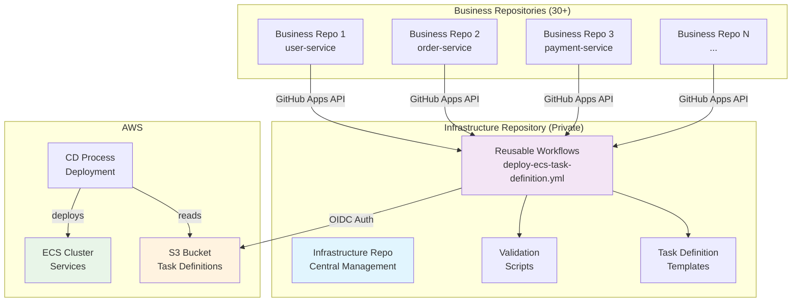
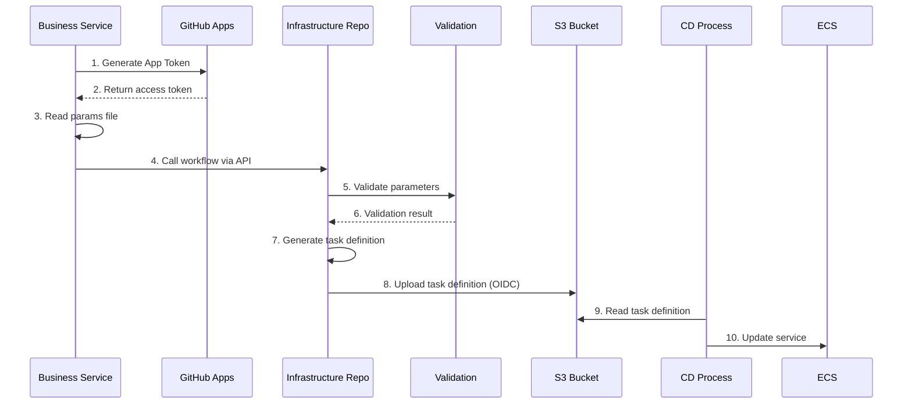
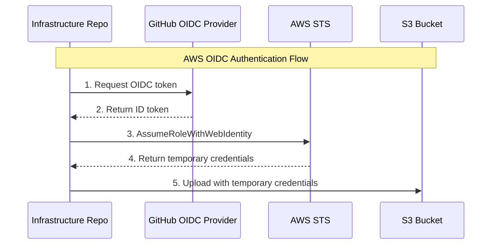
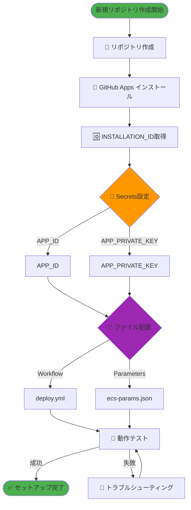
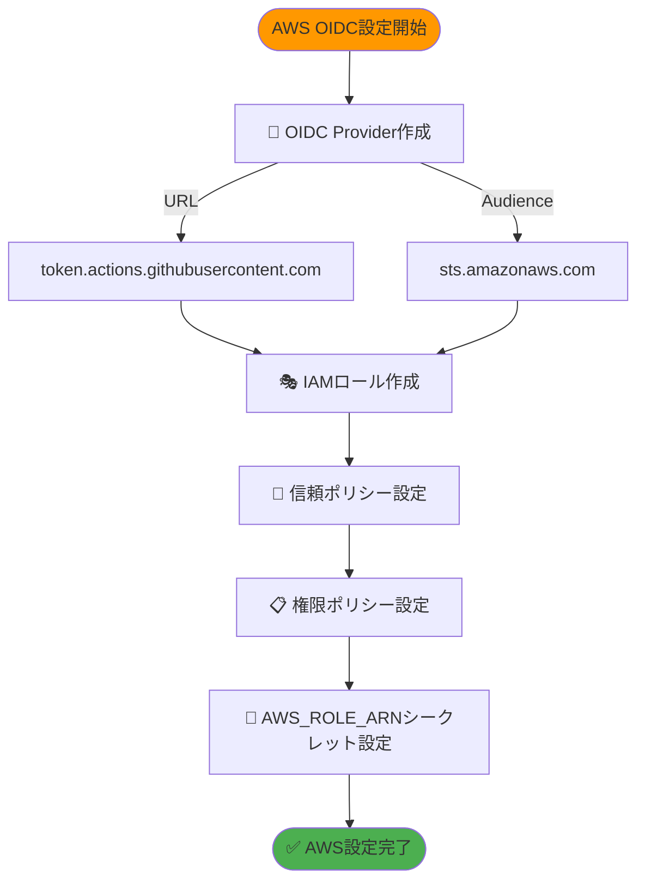
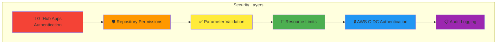

# ECS タスク定義ファイル管理構成設計書

## 目次
1. [概要](#概要)
2. [要件](#要件)
3. [アーキテクチャ](#アーキテクチャ)
4. [ファイル構成](#ファイル構成)
5. [認証設定](#認証設定)
6. [セットアップ手順](#セットアップ手順)
7. [具体的な実装例](#具体的な実装例)

## 概要

本設計書では、マイクロサービス環境におけるECSタスク定義ファイルの運用管理構成について説明します。
GitHub Reusable Workflowsを活用し、インフラチームによる統制と業務チームの柔軟性を両立させる構成を提案します。

## 要件

### 機能要件
- ✅ 業務アプリケーション側でタスク定義ファイル内の一部項目を編集可能
- ✅ インフラ側でCPU/メモリなどのリソース制限を統制
- ✅ GitHub Workflowsの書き方をインフラ側で統制
- ✅ 30個程度のマイクロサービスリポジトリに対応
- ✅ プライベートリポジトリ間でのワークフロー連携

### 非機能要件
- 🔒 セキュアな認証（GitHub Apps + AWS OIDC）
- 🚀 スケーラブルな運用
- 🔧 メンテナンス性の確保

## アーキテクチャ

### システム全体構成図



### データフロー図



## ファイル構成

### インフラリポジトリ構成

```
infra_repository/ (Private)
├── 📁 .github/workflows/
│   └── 📄 deploy-ecs-task-definition.yml    # Reusable Workflow
├── 📁 templates/
│   └── 📄 task-definition-template.json     # ECSタスク定義テンプレート
├── 📁 validation/
│   └── 📄 validate-params.sh                # パラメータバリデーション
├── 📁 scripts/
│   └── 📄 template-processor.sh             # テンプレート処理
└── 📄 README.md                             # 運用ドキュメント
```

### 業務リポジトリ構成

```
app_repository/
├── 📁 .github/workflows/
│   └── 📄 deploy.yml                        # GitHub Apps API でワークフロー呼び出し
├── 📄 ecs-params.json                       # 業務側パラメータ（シンプル化）
├── 📄 src/                                  # アプリケーションコード
└── 📄 README.md                             # サービス固有ドキュメント
```

## 認証設定

### GitHub Apps権限設定図

```mermaid
graph LR
    subgraph "GitHub Apps Configuration"
        GA[GitHub Apps]
        
        subgraph "Required Permissions"
            P1[📖 contents: read]
            P2[⚡ actions: write]
            P3[📊 metadata: read]
        end
        
        GA --> P1
        GA --> P2
        GA --> P3
    end
    
    subgraph "Repository Access"
        IR[Infrastructure Repo<br/>(Private)]
        BR[Business Repos]
    end
    
    GA -.->|Install| IR
    GA -.->|Install| BR
    
    style GA fill:#ff9800
    style P1 fill:#4caf50
    style P2 fill:#2196f3
    style P3 fill:#9c27b0
```

### AWS OIDC認証フロー図



## セットアップ手順

### 新規リポジトリ作成フロー



### AWS OIDC設定手順



## 具体的な実装例

### Infrastructure Repository: Reusable Workflow

```yaml
# .github/workflows/deploy-ecs-task-definition.yml
name: Deploy ECS Task Definition

on:
  workflow_call:
    inputs:
      service_name:
        description: 'Service name'
        required: true
        type: string
      params_content:
        description: 'Parameters file content as JSON string'
        required: true
        type: string
      environment:
        description: 'Deployment environment'
        required: false
        type: string
        default: 'production'
  workflow_dispatch:
    inputs:
      service_name:
        description: 'Service name'
        required: true
        type: string
      params_content:
        description: 'Parameters file content as JSON string'
        required: true
        type: string
      environment:
        description: 'Deployment environment'
        required: false
        type: string
        default: 'production'

jobs:
  validate-and-deploy:
    runs-on: ubuntu-latest
    permissions:
      id-token: write
      contents: read
    steps:
      - name: Checkout Infrastructure Repo
        uses: actions/checkout@v4
      
      - name: Configure AWS credentials
        uses: aws-actions/configure-aws-credentials@v4
        with:
          role-to-assume: ${{ secrets.AWS_ROLE_ARN }}
          aws-region: ap-northeast-1
      
      - name: Create params file from input
        run: |
          echo '${{ inputs.params_content }}' > params.json
      
      - name: Install jq
        run: |
          sudo apt-get update
          sudo apt-get install -y jq
      
      - name: Validate Parameters
        run: |
          chmod +x ./validation/validate-params.sh
          ./validation/validate-params.sh params.json
      
      - name: Generate Task Definition
        run: |
          chmod +x ./scripts/template-processor.sh
          ./scripts/template-processor.sh \
            templates/task-definition-template.json \
            params.json \
            ${{ inputs.service_name }} \
            > task-definition.json
      
      - name: Upload to S3
        run: |
          aws s3 cp task-definition.json \
            s3://github-taskdefinition-test/task-definitions/${{ inputs.service_name }}/task-definition.json
```

### Business Repository: Workflow

```yaml
# .github/workflows/deploy.yml
name: Deploy ECS Task Definition

on:
  workflow_dispatch:
    inputs:
      service_name:
        description: 'Service name'
        required: true
        type: string
      params_file:
        description: 'Parameters file path'
        required: true
        type: string
        default: 'ecs-params.json'
      environment:
        description: 'Deployment environment'
        required: false
        type: string
        default: 'production'

jobs:
  deploy:
    runs-on: ubuntu-latest
    steps:
      - name: Generate App Token
        id: app-token
        uses: actions/create-github-app-token@v1
        with:
          app-id: ${{ secrets.APP_ID }}
          private-key: ${{ secrets.APP_PRIVATE_KEY }}
          repositories: "app_repository,infra_repository"

      - name: Checkout repository
        uses: actions/checkout@v4
        with:
          token: ${{ steps.app-token.outputs.token }}
      
      - name: Read params file
        id: params
        run: |
          content=$(cat ${{ inputs.params_file }})
          echo "content<<EOF" >> $GITHUB_OUTPUT
          echo "$content" >> $GITHUB_OUTPUT
          echo "EOF" >> $GITHUB_OUTPUT

      - name: Call infra workflow
        uses: actions/github-script@v7
        with:
          github-token: ${{ steps.app-token.outputs.token }}
          script: |
            const response = await github.rest.actions.createWorkflowDispatch({
              owner: 'clf13092',
              repo: 'infra_repository',
              workflow_id: 'deploy-ecs-task-definition.yml',
              ref: 'main',
              inputs: {
                service_name: '${{ inputs.service_name }}',
                params_content: `${{ steps.params.outputs.content }}`,
                environment: '${{ inputs.environment }}'
              }
            });
            console.log('Workflow dispatched:', response.status);
```

### パラメータファイル例（シンプル化）

```json
{
  "image": "nginx:latest",
  "cpu": "256",
  "memory": "512",
  "environment": "production"
}
```

### Task Definition Template

```json
{
  "family": "placeholder",
  "networkMode": "awsvpc",
  "requiresCompatibilities": ["FARGATE"],
  "cpu": "256",
  "memory": "512",
  "executionRoleArn": "arn:aws:iam::123456789012:role/ecsTaskExecutionRole",
  "taskRoleArn": "arn:aws:iam::123456789012:role/ecsTaskRole",
  "containerDefinitions": [
    {
      "name": "placeholder",
      "image": "nginx:latest",
      "essential": true,
      "portMappings": [
        {
          "containerPort": 80,
          "protocol": "tcp"
        }
      ],
      "environment": [],
      "logConfiguration": {
        "logDriver": "awslogs",
        "options": {
          "awslogs-group": "/ecs/placeholder",
          "awslogs-region": "ap-northeast-1",
          "awslogs-stream-prefix": "ecs"
        }
      }
    }
  ]
}
```

### バリデーションスクリプト例

```bash
#!/bin/bash
# validation/validate-params.sh

set -e

PARAMS_FILE="$1"

if [ -z "$PARAMS_FILE" ]; then
    echo "Error: Parameters file path is required"
    exit 1
fi

if [ ! -f "$PARAMS_FILE" ]; then
    echo "Error: Parameters file not found: $PARAMS_FILE"
    exit 1
fi

echo "Validating parameters file: $PARAMS_FILE"

if ! jq empty "$PARAMS_FILE" 2>/dev/null; then
    echo "Error: Invalid JSON format in parameters file"
    exit 1
fi

REQUIRED_FIELDS=("image" "cpu" "memory")

for field in "${REQUIRED_FIELDS[@]}"; do
    if ! jq -e ".$field" "$PARAMS_FILE" > /dev/null; then
        echo "Error: Required field '$field' is missing"
        exit 1
    fi
done

CPU_VALUE=$(jq -r '.cpu' "$PARAMS_FILE")
MEMORY_VALUE=$(jq -r '.memory' "$PARAMS_FILE")

if [[ ! "$CPU_VALUE" =~ ^[0-9]+$ ]]; then
    echo "Error: CPU value must be a number"
    exit 1
fi

if [[ ! "$MEMORY_VALUE" =~ ^[0-9]+$ ]]; then
    echo "Error: Memory value must be a number"
    exit 1
fi

echo "Parameters validation passed successfully"
```

### Template Processor Script

```bash
#!/bin/bash
# scripts/template-processor.sh

set -e

TEMPLATE_FILE="$1"
PARAMS_FILE="$2"
SERVICE_NAME="$3"

if [ -z "$TEMPLATE_FILE" ] || [ -z "$PARAMS_FILE" ] || [ -z "$SERVICE_NAME" ]; then
    echo "Usage: $0 <template_file> <params_file> <service_name>"
    exit 1
fi

if [ ! -f "$TEMPLATE_FILE" ]; then
    echo "Error: Template file not found: $TEMPLATE_FILE"
    exit 1
fi

if [ ! -f "$PARAMS_FILE" ]; then
    echo "Error: Parameters file not found: $PARAMS_FILE"
    exit 1
fi

IMAGE=$(jq -r '.image' "$PARAMS_FILE")
CPU=$(jq -r '.cpu' "$PARAMS_FILE")
MEMORY=$(jq -r '.memory' "$PARAMS_FILE")
ENVIRONMENT=$(jq -r '.environment // "production"' "$PARAMS_FILE")

if [ "$IMAGE" = "null" ] || [ "$CPU" = "null" ] || [ "$MEMORY" = "null" ]; then
    echo "Error: Required parameters (image, cpu, memory) are missing"
    exit 1
fi

jq \
  --arg service_name "$SERVICE_NAME" \
  --arg image "$IMAGE" \
  --arg cpu "$CPU" \
  --arg memory "$MEMORY" \
  --arg environment "$ENVIRONMENT" \
  '
  .family = $service_name |
  .containerDefinitions[0].name = $service_name |
  .containerDefinitions[0].image = $image |
  .cpu = $cpu |
  .memory = $memory |
  .containerDefinitions[0].environment = [
    {"name": "ENVIRONMENT", "value": $environment}
  ]
  ' "$TEMPLATE_FILE"
```

## 運用上の考慮事項

### セキュリティ対策



### トラブルシューティング

| 問題 | 原因 | 解決方法 |
|------|------|---------|
| GitHub Apps認証エラー | 秘密鍵形式不正 | PEM形式の確認、改行の保持 |
| GitHub Apps権限エラー | Actions: write権限不足 | GitHub Apps設定でActions: writeを付与 |
| Workflow呼び出し失敗 | プライベートリポジトリアクセス不可 | GitHub Appsがinfra_repositoryにインストール済みか確認 |
| バリデーション失敗 | パラメータ形式不正 | ecs-params.jsonの必須フィールド確認 |
| AWS認証失敗 | OIDC設定不備 | IAMロールの信頼ポリシー確認 |
| S3アップロード失敗 | 権限不足 | IAMロールのS3権限確認 |

### 必要なSecrets設定

#### Business Repository (app_repository)
- `APP_ID`: GitHub App ID
- `APP_PRIVATE_KEY`: GitHub App Private Key（PEM形式）

#### Infrastructure Repository (infra_repository)
- `AWS_ROLE_ARN`: AWS IAMロールARN（OIDC用）

### AWS IAM設定例

#### OIDC Provider設定
- Provider URL: `token.actions.githubusercontent.com`
- Audience: `sts.amazonaws.com`

#### IAMロール信頼ポリシー例
```json
{
  "Version": "2012-10-17",
  "Statement": [
    {
      "Effect": "Allow",
      "Principal": {
        "Federated": "arn:aws:iam::YOUR_ACCOUNT:oidc-provider/token.actions.githubusercontent.com"
      },
      "Action": "sts:AssumeRoleWithWebIdentity",
      "Condition": {
        "StringEquals": {
          "token.actions.githubusercontent.com:aud": "sts.amazonaws.com",
          "token.actions.githubusercontent.com:sub": "repo:clf13092/infra_repository:ref:refs/heads/main"
        }
      }
    }
  ]
}
```

### メンテナンス手順

1. **月次レビュー**
   - 各サービスのリソース使用量確認
   - バリデーションルールの見直し

2. **四半期更新**
   - テンプレートの機能追加
   - セキュリティ設定の見直し

3. **年次監査**
   - 全体アーキテクチャの見直し
   - コスト最適化の検討

---

## 付録

### 参考リンク
- [GitHub Reusable Workflows](https://docs.github.com/en/actions/using-workflows/reusing-workflows)
- [GitHub Apps](https://docs.github.com/en/developers/apps/getting-started-with-apps)
- [ECS Task Definitions](https://docs.aws.amazon.com/AmazonECS/latest/developerguide/task_definitions.html)
- [AWS OIDC with GitHub Actions](https://docs.github.com/en/actions/deployment/security-hardening-your-deployments/configuring-openid-connect-in-amazon-web-services)

### 更新履歴
| 日付 | バージョン | 変更内容 |
|------|-----------|---------|
| 2025-07-12 | 1.0.0 | 初版作成 |
| 2025-07-13 | 1.1.0 | プライベートリポジトリ対応、OIDC認証対応、ワークフロー構造更新 |

---

**このドキュメントに関する質問・要望は、インフラチームまでお問い合わせください。**