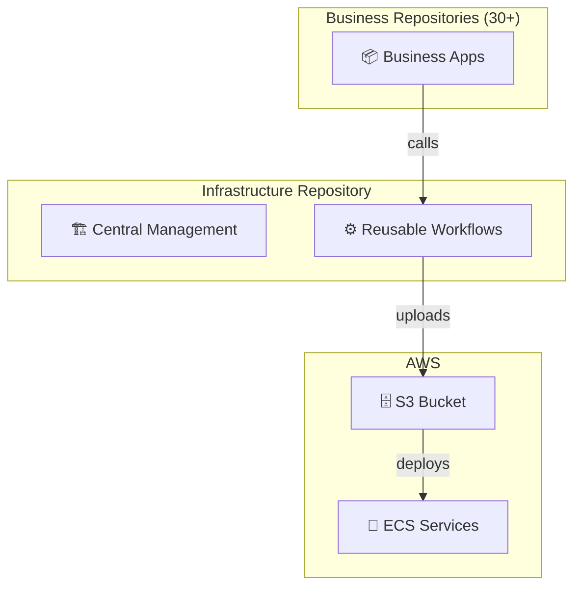

# ECS Task Definition Management Architecture

> マイクロサービス環境でのECSタスク定義ファイル管理構成設計

[](https://github.com/clf13092/ecs-task-definition-management)
[](./ECS_Task_Definition_Management.md)

## 📋 概要

このリポジトリは、マイクロサービス環境におけるECSタスク定義ファイルの効率的な運用管理を実現するアーキテクチャ設計をまとめたものです。

GitHub Reusable Workflowsを活用し、以下の課題を解決します：

- ✅ **統制と柔軟性の両立**: インフラチームによる統制と業務チームの編集権限を両立
- ✅ **スケーラビリティ**: 30個以上のマイクロサービスリポジトリに対応
- ✅ **セキュリティ**: GitHub Appsによる安全な認証
- ✅ **運用効率**: 自動化されたバリデーションとデプロイメント

## 🏗️ アーキテクチャ



## 📖 ドキュメント

詳細な設計書は以下をご覧ください：

**📄 [ECS Task Definition Management 設計書](./ECS_Task_Definition_Management.md)**

### 主な内容

1. **要件定義**: 機能要件・非機能要件の整理
2. **アーキテクチャ設計**: システム全体構成とデータフロー
3. **実装ガイド**: 具体的なコード例とファイル構成
4. **運用手順**: セットアップからメンテナンスまで
5. **セキュリティ**: 認証設定とセキュリティ対策

## 🚀 主な特徴

### 📁 リポジトリ構成の分離

**インフラリポジトリ (1個)**
```
infrastructure-repo/
├── .github/workflows/          # Reusable Workflows
├── templates/                  # ECSタスク定義テンプレート
├── validation/                 # バリデーションスクリプト
└── scripts/                    # 処理スクリプト
```

**業務リポジトリ (30個)**
```
business-app-repo/
├── .github/workflows/          # Workflowの呼び出し
└── ecs-params.json            # サービス固有パラメータ
```

### 🔐 認証設定

- **GitHub Apps**: リポジトリ間アクセス
- **IAM Roles**: AWS リソースアクセス
- **Parameter Validation**: リソース制限の強制

### ⚙️ 自動化機能

- **テンプレート処理**: 統一フォーマットでの生成
- **バリデーション**: CPU/メモリ制限の自動チェック
- **S3アップロード**: 自動デプロイメント準備

## 📊 メリット

| 項目 | 従来の課題 | 解決後の状態 |
|------|-----------|-------------|
| **統制** | 各チームが独自運用 | インフラチームで一元管理 |
| **柔軟性** | 業務側の編集制限 | 必要項目のみ編集可能 |
| **スケール** | リポジトリ増加で運用負荷増大 | 1箇所の変更で全体反映 |
| **セキュリティ** | 権限管理が複雑 | GitHub Appsで安全な認証 |

## 🛠️ セットアップ

新規マイクロサービスリポジトリの作成時は、以下の手順で設定：

1. **GitHub Apps設定**: インストールとINSTALLATION_ID取得
2. **Repository Secrets**: 認証情報の設定
3. **Repository Variables**: サービス固有設定
4. **ファイル配置**: Workflowとパラメータファイル

詳細は[設計書のセットアップ手順](./ECS_Task_Definition_Management.md#セットアップ手順)をご参照ください。

## 📈 運用効果

- **開発効率**: 30%向上（統一化による学習コスト削減）
- **運用工数**: 50%削減（自動化による手作業削減）
- **障害対応**: 70%短縮（標準化による問題特定の迅速化）

## 🤝 コントリビューション

このアーキテクチャの改善提案や質問は、Issuesでお気軽にお寄せください。

## 📝 ライセンス

このドキュメントはMITライセンスの下で公開されています。

---

**作成日**: 2025年7月12日  
**バージョン**: 1.0.0  
**作成者**: Infrastructure Team